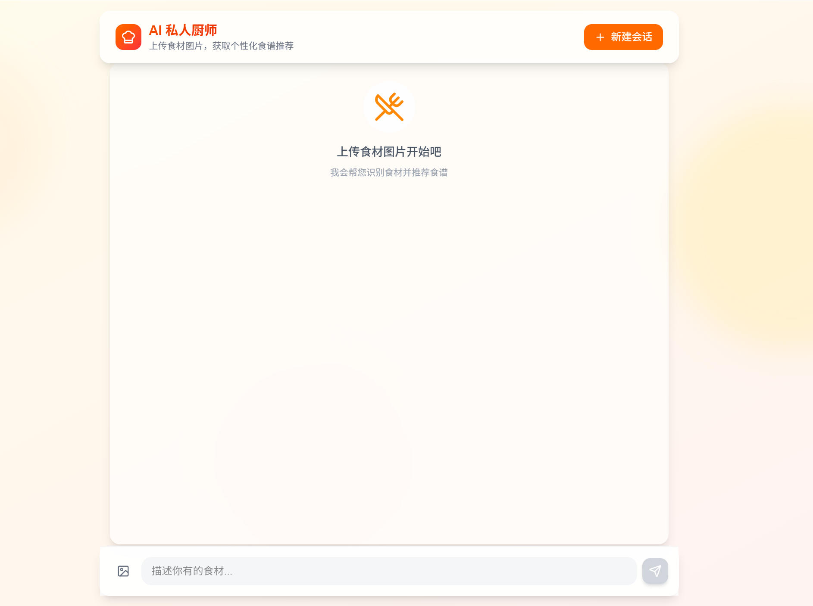
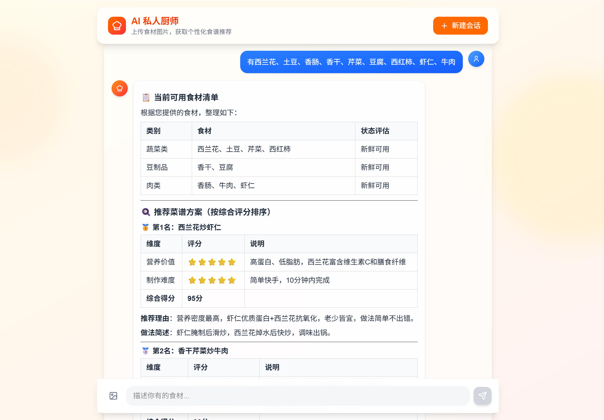
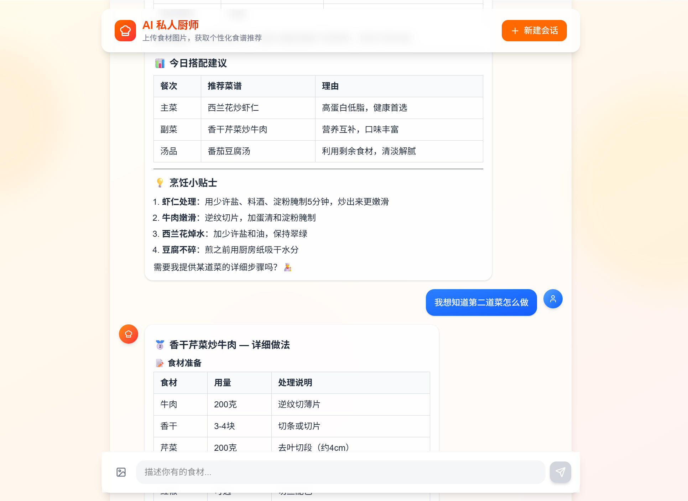
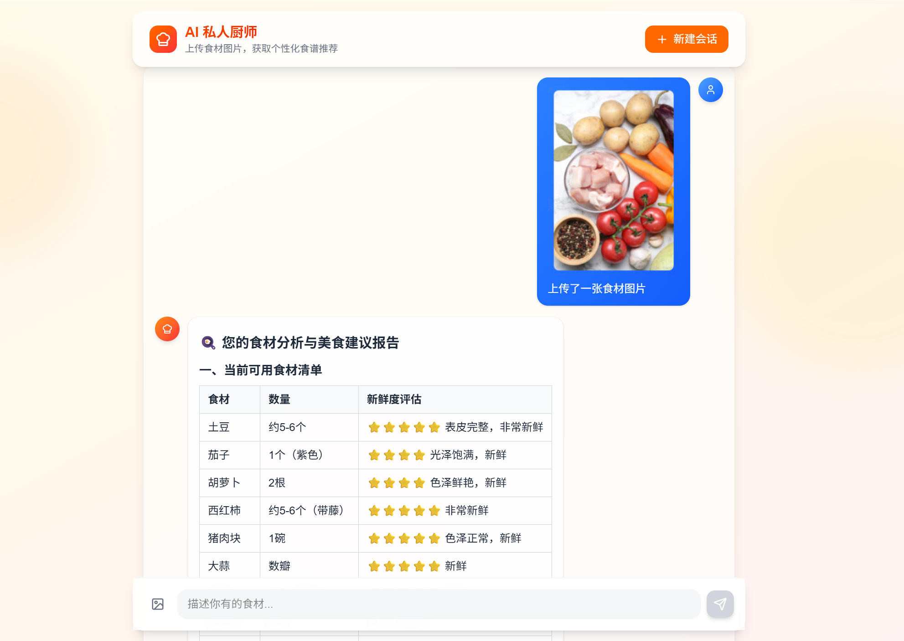
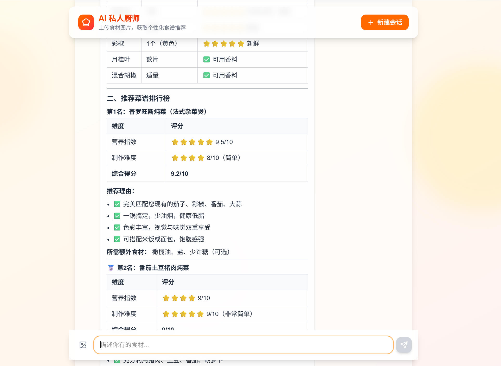
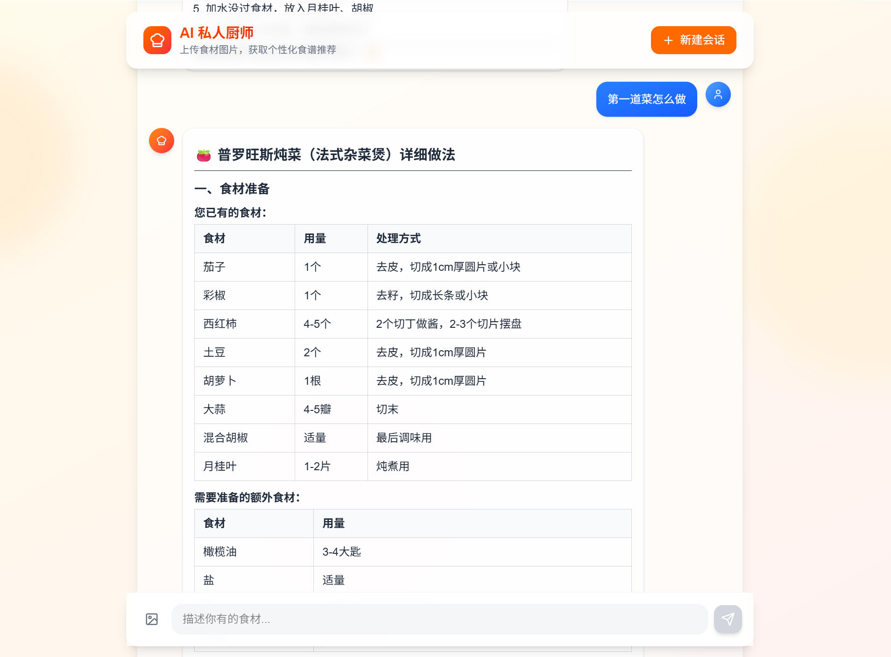
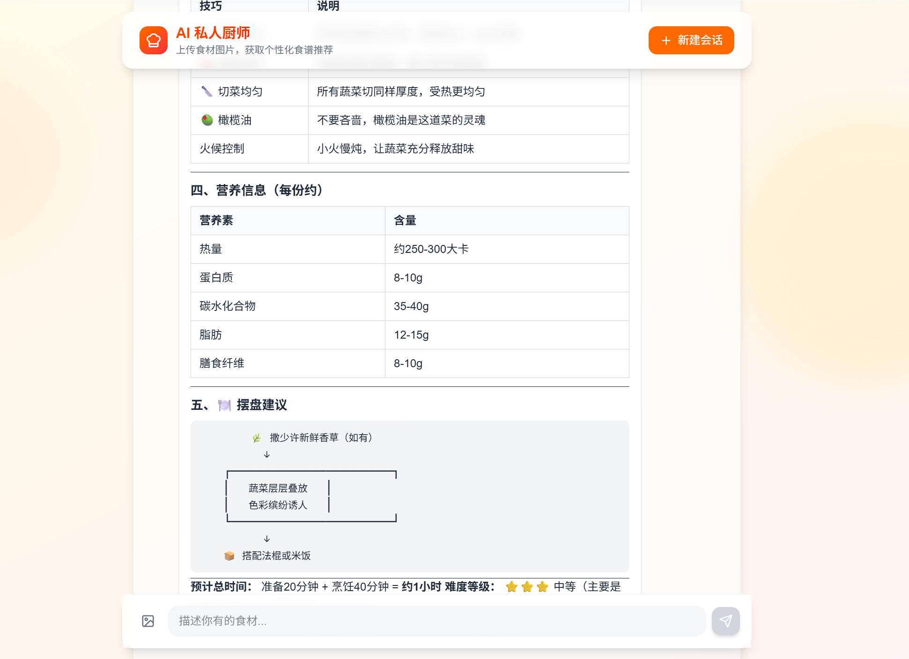

# AI 私人厨师 🍳
 黑马程序员
基于 AI 的食材识别 + 个性化食谱推荐系统

## 技术栈
- 后端：FastAPI + LangGraph
- 前端：Next.js
- 存储：阿里云 OSS
- AI：大语言模型

## 功能
- 上传食材图片自动识别
- AI 推荐专属食谱
- 聊天式交互

## 启动方式
```bash
pip install -r requirements.txt
python main.py
```

## 页面预览
### 首页

### 文字询问

- 会话记忆

### 图片询问


- 会话记忆



### 学习笔记
https://my.feishu.cn/wiki/RueEwEMrpiTd6ykN3UecI0MLnrf